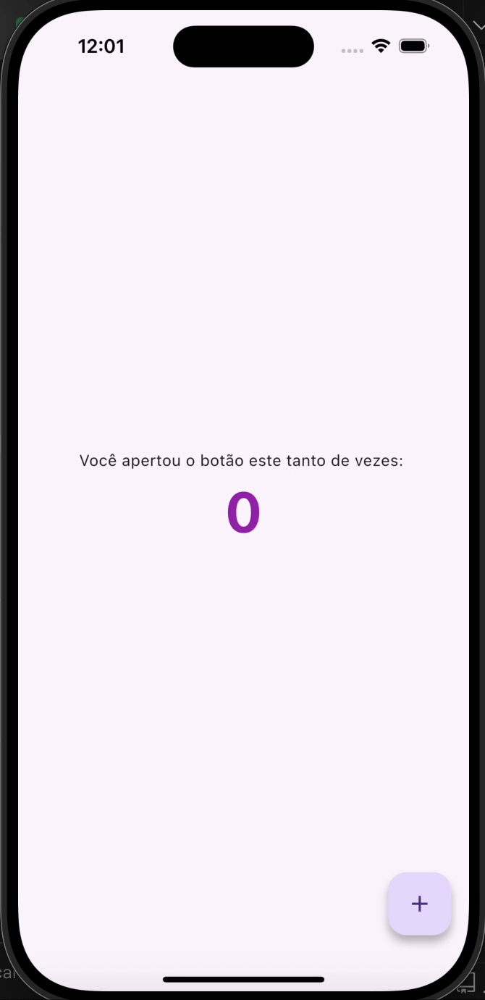

# 🚀 02 - Gerenciamento de Estado com Provider

Neste módulo, demos o primeiro passo em um dos conceitos mais importantes do Flutter: o Gerenciamento de Estado. Utilizamos o pacote `provider` para criar um aplicativo de contador simples, mas poderoso, que separa a lógica da interface do usuário.

## ✅ Conceitos Abordados

- [x] A necessidade de um gerenciamento de estado para evitar o uso excessivo do `setState()`.
- [x] O padrão Provider com seus 3 componentes principais:
  - **`ChangeNotifier`**: A classe que guarda os dados e notifica as mudanças (nosso "DJ").
  - **`ChangeNotifierProvider`**: O widget que disponibiliza o estado para a árvore de widgets (nossa "Torre de Rádio").
  - **`Consumer`**: O widget que escuta as mudanças e reconstrói apenas a parte necessária da UI (nosso "Rádio").
- [x] A diferença entre `Consumer` (para ouvir e reconstruir) e `Provider.of(context, listen: false)` (apenas para chamar métodos/ações).

## 🎬 Demonstração

Abaixo, uma pequena demonstração do aplicativo contador em funcionamento:

