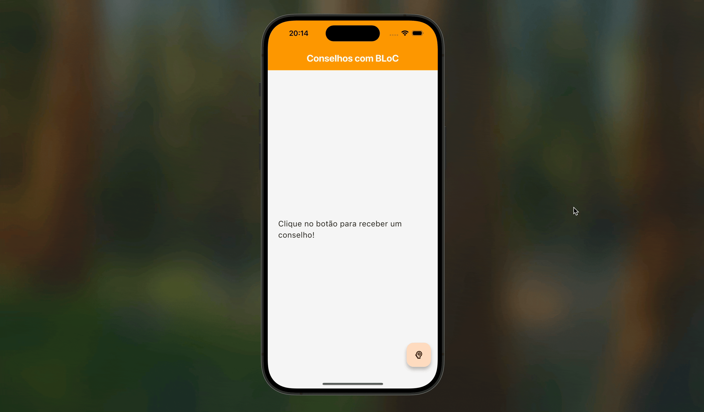

# 🔮 App Gerador de Conselhos com BLoC

Este projeto finaliza o bootcamp de Gerenciamento de Estado, aplicando a arquitetura **BLoC** em um cenário com requisições assíncronas (API).

O app consome a [Advice Slip API](https://api.adviceslip.com/) para buscar um conselho aleatório, gerenciando os diferentes estados da UI (inicial, carregando, sucesso, erro) de forma explícita e segura.

## 🏛️ Arquitetura BLoC Aplicada

-   **Eventos:** A ação do usuário (`NovoConselhoPedido`) é modelada como uma classe de evento.
-   **Estados:** O estado da UI é representado por múltiplas classes (`ConselhoInitial`, `ConselhoLoading`, `ConselhoSuccess`, `ConselhoError`), garantindo que a tela sempre saiba exatamente o que exibir.
-   **BLoC:** A classe `ConselhoBloc` recebe o evento, chama o `Service` para buscar os dados e `emite` os estados correspondentes ao resultado.
-   **Service Layer:** A lógica de acesso à API é isolada em um `ConselhoService`, mantendo o BLoC focado apenas na lógica de negócio.

## 🛠️ Conceitos de `flutter_bloc`

-   **`BlocProvider`**: Para disponibilizar a instância do `ConselhoBloc`.
-   **`BlocBuilder`**: Para ouvir as mudanças de `Estado` e reconstruir a UI de forma condicional, tratando cada tipo de estado (`is ConselhoLoading`, `is ConselhoSuccess`, etc.).
-   **`context.read<ConselhoBloc>().add()`**: Para enviar `Eventos` da UI para o BLoC.

## 🎬 Demonstração

