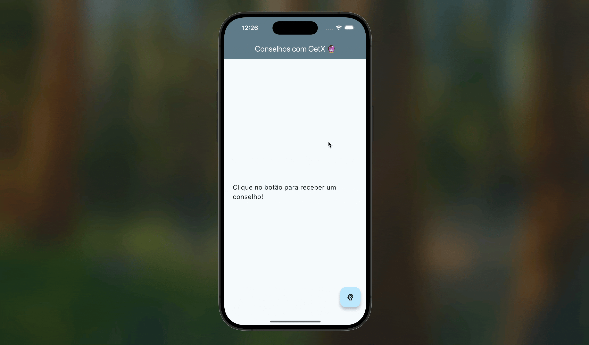

# 🔮 App Gerador de Conselhos com GetX

Este projeto faz parte do bootcamp de Gerenciamento de Estado e tem como objetivo aplicar o **GetX** em um cenário com requisições assíncronas (API).

O app consome a [Advice Slip API](https://api.adviceslip.com/) para buscar um conselho aleatório e exibi-lo na tela, seguindo uma arquitetura limpa com separação de responsabilidades entre `Service` e `Controller`.

## 🎯 Funcionalidades

-   Busca um conselho aleatório de uma API pública.
-   Exibe um indicador de carregamento (`CircularProgressIndicator`) durante a requisição.
-   Utiliza o `Get.snackbar` para exibir mensagens de erro de forma amigável.

## 🛠️ Conceitos de GetX e Arquitetura Aplicados

-   **`GetxController`**: Para gerenciar o estado da UI (`carregando`, `conselho`).
-   **`.obs` e `Rx<T>`**: Para criar variáveis reativas.
-   **`Obx`**: Para reconstruir a UI de forma reativa às mudanças de estado.
-   **Injeção de Dependências**: Uso de `Get.put()` para registrar o `Service` e o `Controller`, e `Get.find()` para que o Controller acesse o Service.
-   **`Get.snackbar`**: Para feedback ao usuário.
-   **Service Layer**: Separação da lógica de acesso a dados (`ConselhoService`) da lógica de estado da UI (`ConselhoController`).

## 🎬 Demonstração

