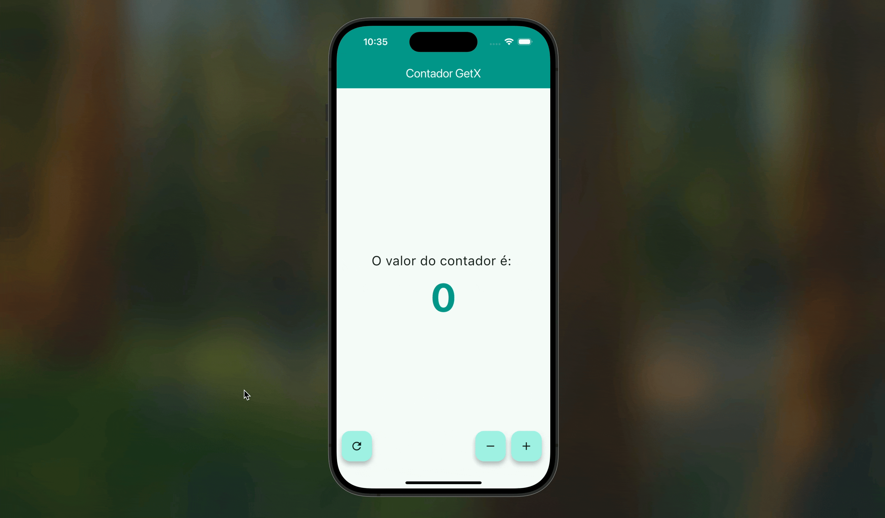

# 🔢 App Contador com GetX

Este projeto é o primeiro do bootcamp de Gerenciamento de Estado. O objetivo foi reconstruir o app contador, originalmente feito com Provider, utilizando o framework **GetX**.

Esta prática serviu para comparar as duas abordagens, focando na simplicidade e na redução de código que o GetX proporciona.

## 🎯 Funcionalidades

-   Incrementar o contador.
-   Decrementar o contador.
-   Zerar o contador.

## 🛠️ Conceitos de GetX Aplicados

-   **`GetxController`**: Para gerenciar a lógica de estado.
-   **`.obs`**: Para criar variáveis reativas que atualizam a UI automaticamente.
-   **`Obx`**: O widget que escuta as variáveis `.obs` e se reconstrói.
-   **`Get.put()`**: Para injetar o controller e torná-lo disponível para a UI.
-   Acesso direto aos métodos do controller no `onPressed` dos botões.

## 🎬 Demonstração

## 💡 Aprendizados

A diferença na quantidade de código e em como fazer o estado funcionar é notável em comparação com o Provider. O GetX é extremamente direto, eliminando a necessidade de `notifyListeners()` e do `context` para muitas operações, o que torna o desenvolvimento muito rápido.