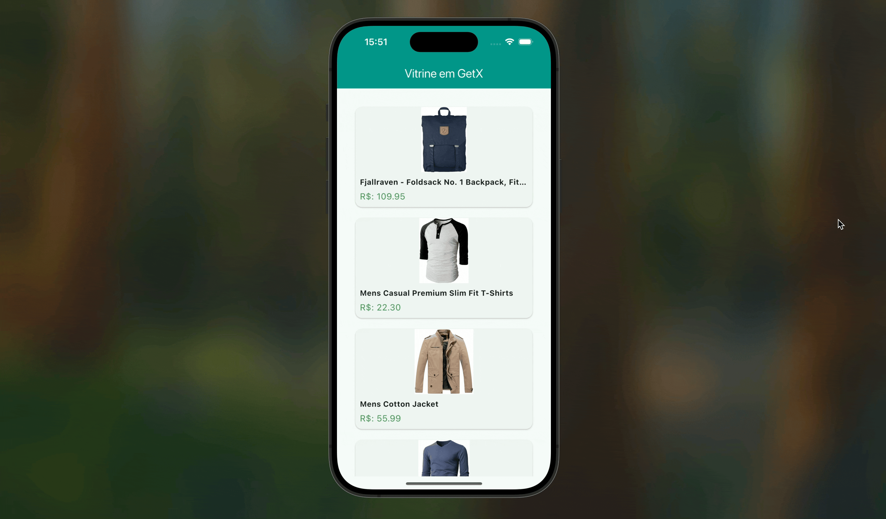

# 🛍️ Vitrine de Produtos com GetX

Este projeto, parte do bootcamp de Gerenciamento de Estado, aplica o **GetX** em um cenário mais complexo: buscar e exibir uma lista de produtos de uma API externa.

O app consome a [Fake Store API](https://fakestoreapi.com/) para exibir uma vitrine de produtos, implementando uma arquitetura limpa com `Service` e `Controller`.

## 🎯 Funcionalidades

-   Busca a lista de produtos da API automaticamente na inicialização da tela (`onInit`).
-   Exibe um indicador de carregamento (`CircularProgressIndicator`) durante a requisição.
-   Renderiza a lista de produtos em `Cards` individuais de forma eficiente com `ListView.builder`.
-   Mostra a imagem, título e preço formatado para cada produto.

## 🛠️ Conceitos de GetX e Arquitetura Aplicados

-   **`GetxController`** e ciclo de vida com **`onInit`**.
-   **Listas Reativas (`RxList`)**: Uso de `var produtos = <Produto>[].obs;` e o método `.assignAll()` para atualizar a lista.
-   **`Obx`**: Para reconstruir a UI de forma reativa a mudanças na lista e no estado de carregamento.
-   **Injeção de Dependências**: Uso de `Get.put()` e `Get.find()` para prover e acessar o `Service` e o `Controller`.
-   **Service Layer**: Separação da lógica de acesso a dados (`VitrineService`) da lógica de estado (`VitrineController`).

## 🎬 Demonstração

