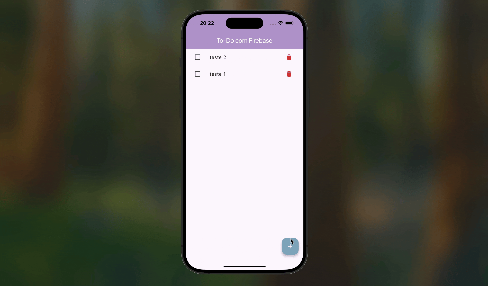

# ✅ To-Do App com Firebase

Este projeto é o primeiro do módulo de integração com backend e representa um aplicativo full-stack completo, conectando um cliente Flutter a um backend na nuvem com o Firebase.

O aplicativo permite que os usuários gerenciem uma lista de tarefas que é persistida em tempo real no **Cloud Firestore**, o banco de dados NoSQL do Firebase.

## 🎯 Funcionalidades

-   **Adicionar** novas tarefas que são salvas instantaneamente na nuvem.
-   **Ler** a lista de tarefas em tempo real. Qualquer mudança no banco de dados (feita por este ou outro dispositivo) é refletida na tela automaticamente.
-   **Atualizar** tarefas, marcando-as como concluídas (com feedback visual de texto riscado).
-   **Remover** tarefas da lista.

## 🛠️ Conceitos Técnicos Aplicados

-   **Firebase:** Configuração de um projeto Firebase e conexão com um app Flutter.
-   **Cloud Firestore:** Uso do banco de dados para realizar todas as operações **CRUD** (Create, Read, Update, Delete).
-   **Streams em Tempo Real:** Utilização do método `.snapshots()` do Firestore para criar um fluxo de dados em tempo real que atualiza a UI automaticamente.
-   **Arquitetura Limpa:** Separação de responsabilidades com uma camada de **Serviço** (`TarefasService`) que lida com a comunicação com o Firebase, e uma camada de **Estado** (`TarefaProvider`) que gerencia o estado da UI.
-   **Modelo de Dados:** Criação de uma classe `Tarefa` com métodos `fromFirestore` e `toFirestore` para a conversão de dados entre o app e o banco de dados.

## 🎬 Demonstração

